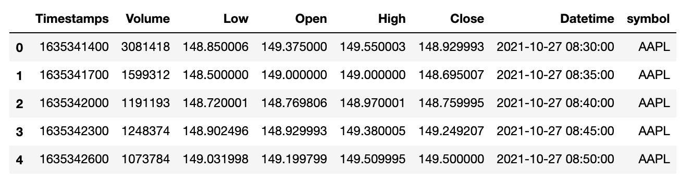
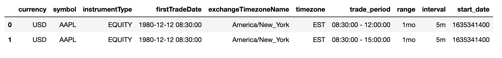
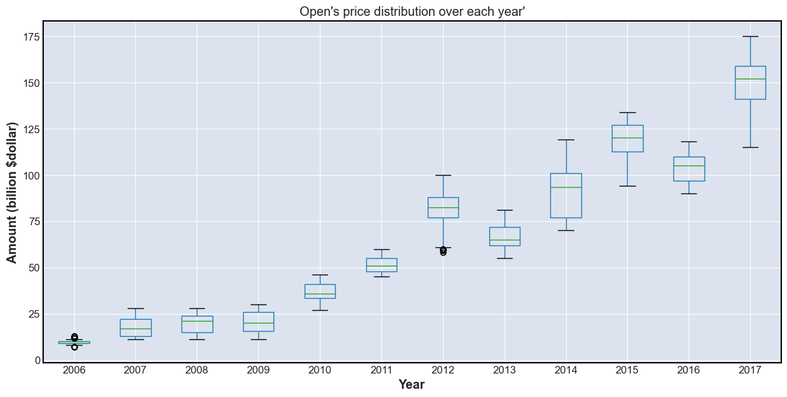
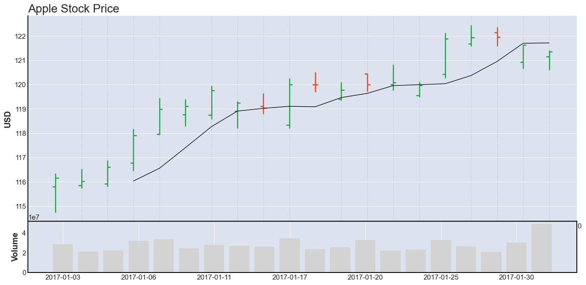
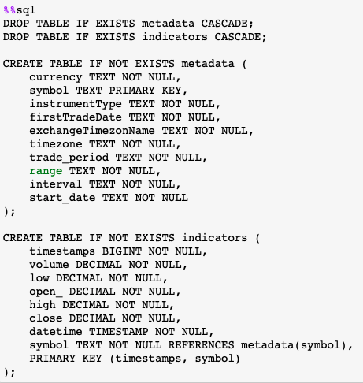
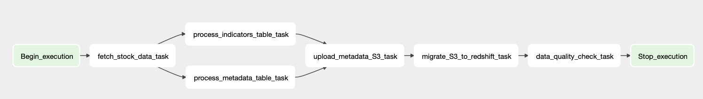

# NYSE Data Pipeline

##### Author: Dung Ngo

## Udacity Data Engineering's Capstone Project

#### Project Summary

This task is to build an ETL pipeline to fetch data from external API to S3 and PostgreSQL. It is a part of the project to build an interactive dashboard to track real-time popular NYSE stock data.
  

### General Steps

The project follows the follow steps:

- [Step 1: Scope the Project and Gather Data](#step-1)
- [Step 2: Explore and Assess the Data](#step-2)
- [Step 3: Define the Data Model](#step-3)
- [Step 4: Run ETL to Model the Data](#step-4)
- [Step 5: Complete Project Write Up](#step-5)
- [License](#license)

### File structure

This directory's file structure is showed as following 

1. Exploration (Pandas & MLP).ipynb: shows data exploration and preliminary analysis for stock data
2. Staging (API & S3).ipynb: shows how data is moved to S3
3. Data warehouse (S3 & Redshift).ipynb: shows how data is migrated from S3 to Redshift
4. ETL Pipeline (Airflow).ipynb: shows how all above tasks are put together in an ETL pipeline using Airflow
      

### Step 1: Scope the Project and Gather Data

#### 1. Scope

Data is fetched from an external API (Yahoo Finance API), loaded to S3, and finally migrated to Redshift. The end goal is to create an internal data storage and process data without worrying about rate of limit of API calls.  

#### 2. Describe and gather data

Data is fetched at endpoint `/getchart` and then is parsed into 2 tabular tables, called `indicators` and `metadata`.

- `indicators` will contain timeseries data of opening, high, low, and closing (OHLC) price for a particular stock
- `metadata` table will demonstrate a specific company profile (e.g. Amazon or Apple).  

A few top entries of two tables are showed in the following figures. Other details like data types and number of entries in each table are also showed in the notebook.  
</img>
Figure 1: `indicators` in Staging (API & S3).ipynb
  
</img>
Figure 2: `metadata` in Staging (API & S3).ipynb
   

### Step 2: Explore and Assess the Data

#### 1. Explore the data

I uses a Kaggle dataset (called DJIA) for data analysis. It includes 30 popular historical timeseries stock data, such as AAPL, AMZN, GOGL, JPM, ...  
In Exploration (Pandas & MLP).ipynb, I compute 5 statistics (max, min, avg, median, IQR) for OHLC columns and display them in boxplots. Furthermore, I graphed an OHLC chart to see how price changes in a specific timeframe.  
</img>
Figure 3: Opening price in Jan 2017 (1-hour interval)
  
</img>
Figure 4: AAPL's OHLC chart
   

### Step 3: Define the data model

#### 1. Conceptual data model

The data model follows a STAR schema, where `indicators` is a fact table while `metadata` is a dimensional table. As I explore new API endpoints, more tables will be added and normalized. Two advantages of using star schemas:

- It allows fast queries without afraid of deeply nested JOIN commands.
- Star schema is much easier to comprehend at high level when presenting to clients and executive members  

`Data warehouse (S3 & Redshift).ipynb` shows a primary-foreign-key relationship between metadata and indicators tables via a column called symbol (e.g. AAPL or AMZN). The following figures show the table names, columns, and constraints for two tables.  
</img> 
Figure 5: Schemas for `indicators` and `metadata`
  

#### 2. Mapping out data pipelines

The following graph view of `nyse-stock` DAGs shows data flow.  
</img>
Figure 6: Graph view of ETL pipeline
   

### Step 4: Run pipelines to model the data

#### 1. Create the data model

The details about the pipeline can be seen in `etl` folder which includes `dags` and `plugins` folder.

#### 2. Data quality checks

In `check_quality_operator.py` under folder `etl/plugins/operators`, there are 2 quality checks:

- non-empty-table checks whether any table is empty or not.
- non-duplicate-primary-key checks whether any table contains duplicate primary keys. If any of them has, a DAG will raise an error and subsequent operators will fail.

Data quality checks will ensure that the entire pipeline run correctly.

#### 3. Data dictionary

The following two tables show the data dictionaries for `indicators` and `metadata`
Table | Description | Owner | Last accessed | Last updated | Number of columns | Primary key
--- | --- | --- | --- | --- | --- | --- |
indicators | Timeseries OHLC stock data | Redshift - dngo | Nov 28th, 2021 | Nov 28th, 2021 | 8 | (timestamps, symbol)
metadata | Company profiles | Redshift - dngo | Nov 28th, 2021 | Nov 28th, 2021 | 10 | symbol

Figure 6: Data dictionary   

| Column               | Description                              | Data type | Constraint  | Example            |
| -------------------- | ---------------------------------------- | --------- | ----------- | ------------------ |
| currency             | currency unit                            | text      | not null    | USD                |
| symbol               | company abbr.                            | text      | primary key | AAPL (Apple Inc.)  |
| instrumentType       | type of stock                            | text      | not null    | equity             |
| firstTradeDate       | initial public offering (IPO)            | text      | not null    | 1980-12-12 8:30:00 |
| exchangeTimezoneName | timezone name                            | text      | not null    | America/New York   |
| timezone             | timezone                                 | text      | not null    | EST                |
| trade_period         | trade peiod                              | text      | not null    | 8:30 - 12:00       |
| range                | query range                              | text      | not null    | 1mo (1 month)      |
| interval             | query interval                           | text      | not null    | 1h (1 hour)        |
| start_date           | the minimum trade datetime in this query | text      | not null    | 1635341400         |

Figure 7: `metadata`'s schema   

| Column     | Description                        | Data type | Constraint           |
| ---------- | ---------------------------------- | --------- | -------------------- |
| timestamps | timestamps                         | big int   | not null             |
| volume     | total trading volume               | decimal   | not null             |
| low        | low price at current timeframe     | decimal   | not null             |
| open\_     | opening price at current timeframe | decimal   | not null             |
| high       | high price at current timeframe    | decimal   | not null             |
| close      | closing price at current timeframe | decimal   | not null             |
| datetime   | current datetime                   | timestamp | not null             |
| symbol     | company abbr.                      | text      | not null foreign key |

Figure 8: `indicators`'s schema    

### Step 5: Complete project write up

#### 1. Why S3, Redshift, and Airflow?

- S3 can store any type of file object.
- Redshift can scale horizontally and vertically and has high performance for OLAP queries and no-single-point-failure characteristic.
- Airflow is an open-source projects with an active community where I can learn in-depth about its implementation.

#### 2. How are data updated and in which interval?

Data will be fetched every 1 minute using Airflow scheduler. When it runs, new S3 files will be generated and appended to Redshift. Since popular stocks such as AAPL, AMZN, or BAC are highly volatile, data needs to be frequently updated.

#### 3. Use cases

If data was increased by 100x, it is recommended to increase the number of nodes or node type in Redshift to process data faster. In Redshift dashboard, it is recommended to check number of queries and data volume for latency and bottleneck issues. Finally, we should deploy our pipeline to bigger EC2 instances with larger RAM and disk to process data faster.
  
Since this pipeline is updated every 1 minute, it assures that the dashboard will be updated by 7 am every day.
  
Since Redshift can easily resolve an issue of many connections at once, we don't have to worry about if database is accessed by 100+ people. However, we should assign IAM roles wisely to each person to limit their ability on Redshift.
